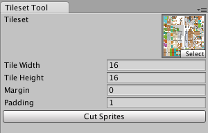

# TiledUtilities

A set of utilities for working with [Tiled](http://mapeditor.org) maps in Unity.

*Note: This is very much a WIP. Lots of things are yet to be implemented.*

The goal of this is to be an editor tool (no runtime scripts) that can import a Tiled TMX map and produce a usable game scene. The tool converts maps from Tiled:

Into objects in Unity:

## Tileset Tool

Open with `Window->Tiled->Tileset Tool`.

The purpose of this tool is to automatically set a texture to use multiple sprites and provide a faster way to cut up the texture into the necessary tiles in a way that is compatible with the map converter. Namely this tool keeps empty sprites so that the GID indexing can be done more easily. This tool is also much faster than the built in Sprite Editor for chopping up large tilesets, possibly simply because it doesn't check if the sprites are empty.

## Map Converter

Open with `Window->Tiled->Map Converter`.

This is the main editor window for importing a TMX map. It's a pretty simple process:

1. Provide a GameObject to act as the root of the map. You can leave this blank and a new GameObject will be created in the current scene using the name of the TMX file. If a GameObject is provided, all of its children are removed to simplify the code, though eventually I'd like to try and not do this so that object references can be maintained.
2. Provide a path to a TMX file in your Assets folder. The little `...` button will show you a file dialog to make this easier.
3. Click `Convert` and it will build out all your game objects.

Here's how things are (currently) translated:

- All layers are represented as Z-ordered objects in the map root. Image layers are not currently supported.
- Tile layers generate 1 sprite per tile and are created underneath the layer objects.
- Objects in object groups are created by looking for a prefab in the directory containing the TMX file (or child directories) that has a file name equivalent to the `Type` property of the object. In the example above, the door objects have a `Type` of "Door" and so the converter finds the `Door` prefab and instantiates it and places it.

A primary driving goal here is that all TMX handling is done in the editor only; you shouldn't have to ship any Tiled specific code or files (TMX or TSX) with your game. Hence everything is built out into standard Unity objects.
